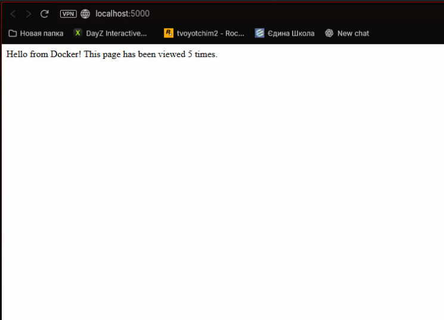
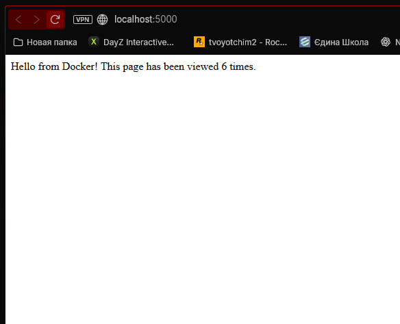

## **📸 Скріншот демонстрації роботи лічильника**

## Висновки
✅ Переваги використання Docker Compose:
- Простота запуску - одна команда для всіх сервісів
- Ізоляція середовища - кожен сервіс в окремому контейнері
- Масштабованість - легке додавання нових сервісів
- Відтворюваність - однакова робота на всіх системах
;0
